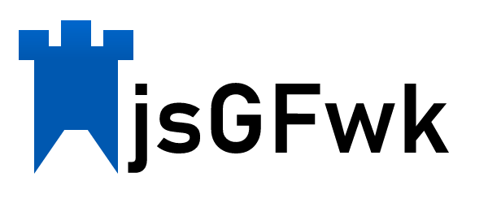

# jsGFwk v3: Release 1

## IMPORTANT NOTE

This version is missing some minor legacy plugins but it is already fully functional. Main plugins have been migrated and tested. You are welcome to use each individual file (As in the old framework) to use *jsGFwk*, or simple use the bundle that can be found in **dist** directory.

## What's this?

This is the third version of jsGFwk and it will become the official one.

The key difference with the older version is the JavaScript language version used on v3.

This version is trying to keep retrocompatibily when it is possible. If you have used version 1, you might need to change the way that you import the plug ins and some minor upgrades to some functions.

## What's jsGFwk?

jsGFwk is a simple, but powerful, JavaScript videogame framework.

The first version of jsGFwk was built more than 7 years ago in 40 hours. From that point the framework kept evolving, adding new features and plug ins to it.

The main difference (*and its reason to exists*) with other frameworks in the market is that jsGFwk doesn't tries to take control of what is happening on your game. It only provides a foundation to build games and gives you full control through your code.

Additionally, it is intended to be extended with plug ins, meaning that, if you find a better way to do something that the jsGFwk does out of the box, you can code it and add it into the foundation.

Each file in the framework is, actually, a plug in that provides a particular functionality. From sound, keyboard and mouse handling, to drawing in the screen or saving data into the browser.

#

